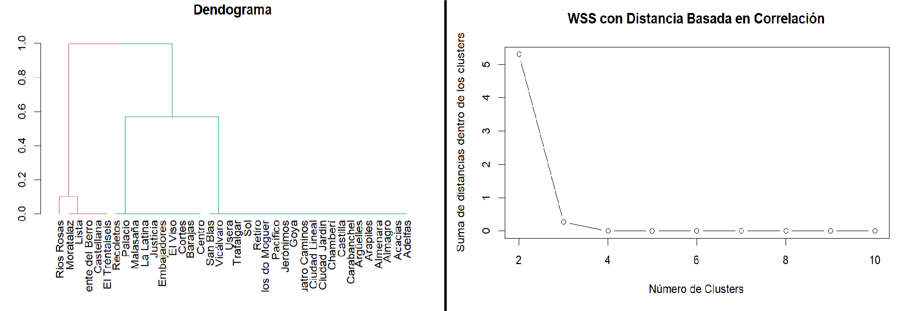
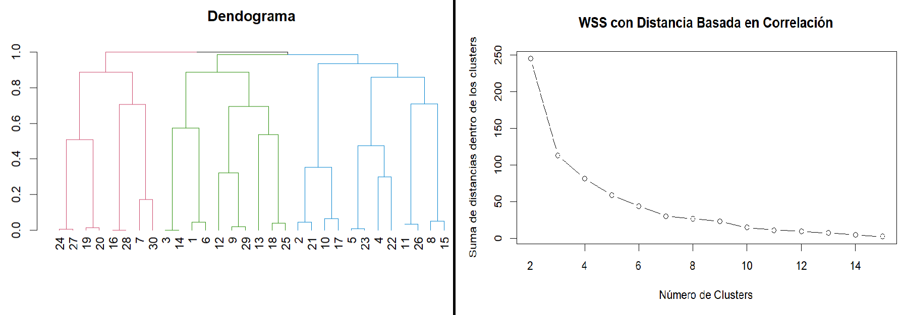
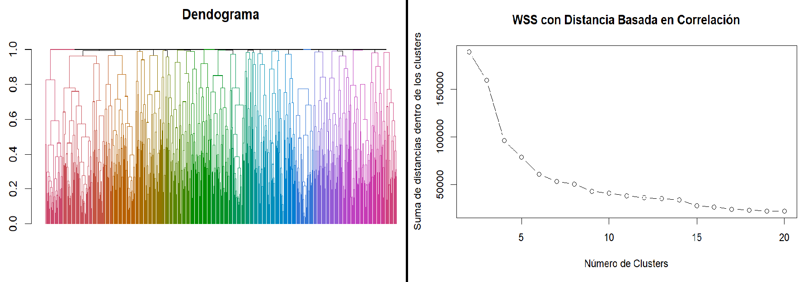

# Presentación de la Función WSSC (Within-Cluster Sum of Squares)

## 1. Introducción
La función wssc es una herramienta innovadora diseñada para optimizar el análisis de clusters. 
Esta implementación única combina el clustering jerárquico, el cálculo de la suma de cuadrados dentro del cluster y la visualización del método del codo en una sola función eficiente y fácil de usar.
Si ya se cuenta con una matriz de distancias, wssc puede funcionar tanto para datos con distribución uniforme como para datos con distribución no uniforme.

## 2. Fundamento Teórico
•	Clustering Jerárquico: Utiliza el método de enlace completo para agrupar datos de manera jerárquica.
•	WSSC: Mide la compacidad de los clusters, proporcionando una métrica cuantitativa de la calidad del clustering.
•	Método del Codo: Técnica visual para determinar el número óptimo de clusters.

## 3. Características Únicas
•	Integración de múltiples técnicas en una sola función.
•	Visualización automática del método del codo.
•	Aplicable a cualquier matriz de distancia válida.
•	Personalizable en términos del número máximo de clusters a considerar.

## 4. Implementación
La función WSSC se implementa en R y se presenta un ejemplo práctico de cómo se aplicó a un conjunto de datos.
[Ver el análisis completo](https://GONZALOCACERES2004.github.io/Funcion-WSSC/WSSC.html)

## 5. Beneficios
•	Eficiencia Computacional: Optimizada para manejar grandes conjuntos de datos.
•	Facilidad de Uso: Requiere solo la matriz de distancia como entrada principal.
•	Visualización Integrada: Genera automáticamente la gráfica del método del codo.
•	Versatilidad: Aplicable a una amplia gama de problemas de clustering.
•	Reproducibilidad: Encapsula todo el proceso en una única función.
•	Debido a su simplicidad, WSSC permite una evaluación rápida de diferentes números de clusters, lo que puede ser útil en etapas iniciales de exploración de datos.
•	WSSC es más simple de calcular e interpretar en comparación con el método Silhouette. Esto la hace más accesible para usuarios con menos experiencia en análisis de datos.

## 6. Aplicaciones Prácticas
•	Segmentación de clientes en marketing.
•	Análisis de datos genómicos en bioinformática.
•	Clasificación de documentos en procesamiento de lenguaje natural.
•	Agrupación de patrones en reconocimiento de imágenes.

## 7. Comparación con Métodos Existentes
•	A diferencia de funciones estándar como kmeans() en R, WSSC proporciona una visualización integrada.
•	Complementa métodos como el coeficiente Silhouette, ofreciendo una perspectiva adicional.
•	Más flexible que implementaciones en paquetes como NbClust, permitiendo personalización.

## 8. Limitaciones y Consideraciones
•	Sensibilidad a la elección del método de enlace en el clustering jerárquico.
•	La interpretación del "codo" puede requerir juicio experto en algunos casos.

## 9. Conclusiones y Futuras Direcciones
•	La función WSSC representa un avance significativo en la simplificación y optimización del análisis de clusters.
•	Futuras mejoras podrían incluir la incorporación de métodos adicionales de clustering y métricas de evaluación.

Se muestran ejemplos en los que a partir de la correlación obtenemos la matriz de distancia, con ésta graficamos el dendograma y aplicacmos la función WSSC   

